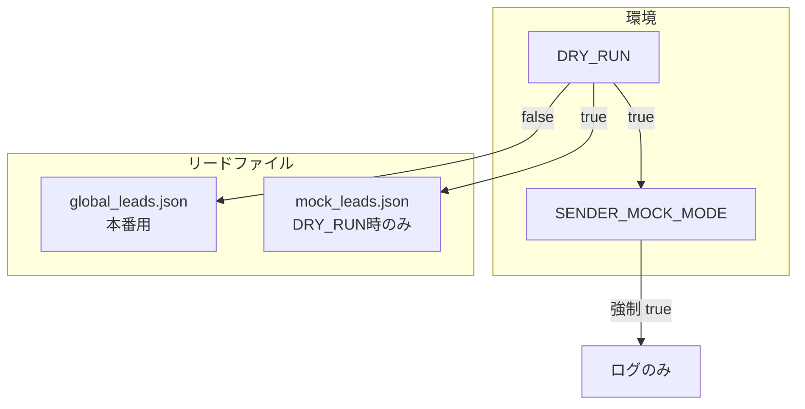

# メール送信プロセス全体図（Email Process Diagram）

Cursor がメール送信システムの全体像を秒速で把握するための図解です。

---

## メールが作成されてから送信されるまでの工程（ハード・パイプライン）

```mermaid
flowchart LR
    subgraph データ
        A[global_leads.json / mock_leads.json]
    end

    subgraph 発見・生成
        B[GlobalDiscovery]
        C[Report Generator / Builder]
    end

    subgraph 品質ゲート（固定順序）
        D[ConsensusEngine<br/>合議制AI検閲]
        E[AIProposalCorrector<br/>自動修正]
        F[HumanizerEngine<br/>人間味への昇華]
        G[AutoSender._should_skip_address<br/>モック/テスト除外]
        H[is_humanized チェック]
    end

    subgraph 送信
        I[AutoSender.send_proposal_email]
    end

    A --> B
    B --> C
    C --> D
    D -->|REJECTED| E
    E --> D
    D -->|APPROVED| F
    F --> G
    G -->|OK| H
    H -->|True only| I
    G -->|Block| I
```

---

## 安全スイッチとデータ分離



- **DRY_RUN=true**: リードは `mock_leads.json` を参照。`SENDER_MOCK_MODE` は強制的に true になり、送信はログのみ。
- **DRY_RUN=false**: リードは `global_leads.json`。営業時間・日次/時間枠の送信上限を適用。

---

## 品質ゲートの順序（抜本的強化後の固定パイプライン）

| 順序 | ゲート | 役割 |
|------|--------|------|
| 1 | **ConsensusEngine** | 法務・ブランド・運営の合議。1つでも REJECTED なら自動修正へ。 |
| 2 | **AIProposalCorrector** | 修正後、再び ConsensusEngine で検証。 |
| 3 | **HumanizerEngine.polish** | AI臭を排除し、人間らしい文に昇華。**ここを通った本文のみ** is_humanized=True で送信可能。 |
| 4 | **_should_skip_address** | example.com / mock / test 等をブロック。 |
| 5 | **is_humanized** | False の場合は実送信をブロック（MOCK 時を除く）。 |

---

## 参照

- 心臓部: `scripts/auto_sender.py`, `run_automation.py`
- 品質: `scripts/humanizer.py`, `scripts/safety_guardrails.py`（ConsensusEngine / UratoriEngine）
- 設定: `.env` の `DRY_RUN`, `SENDER_MOCK_MODE`
